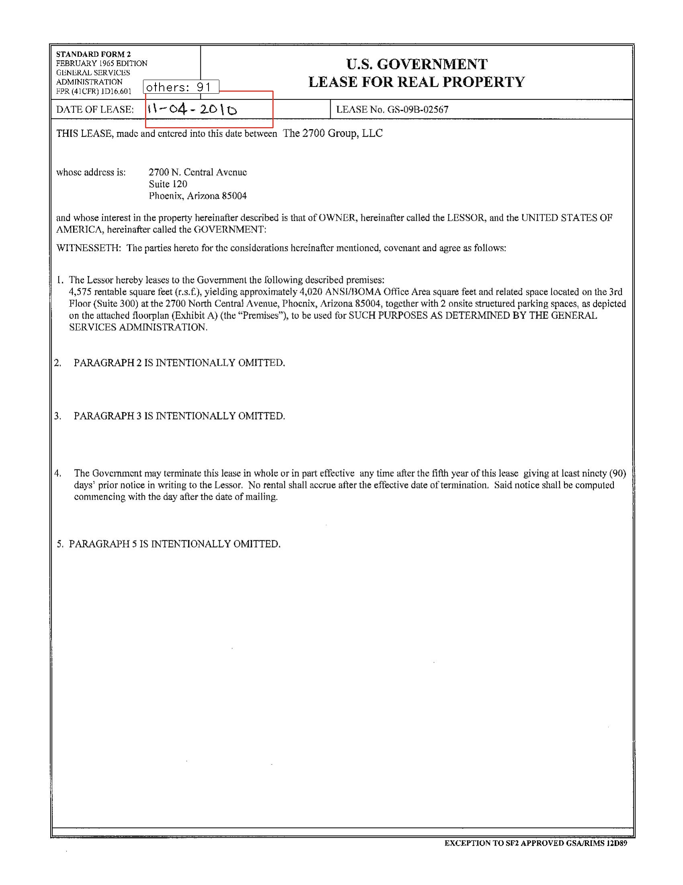
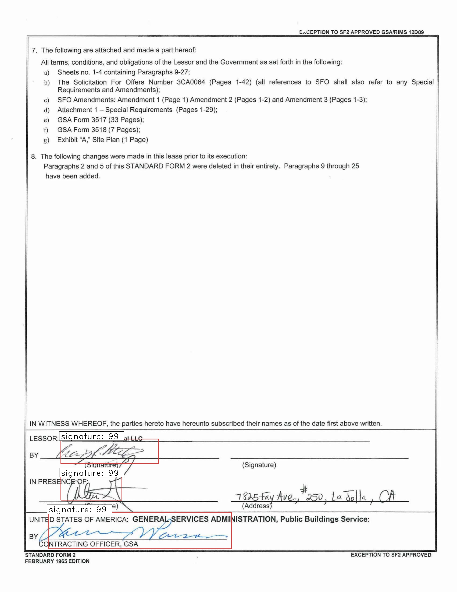
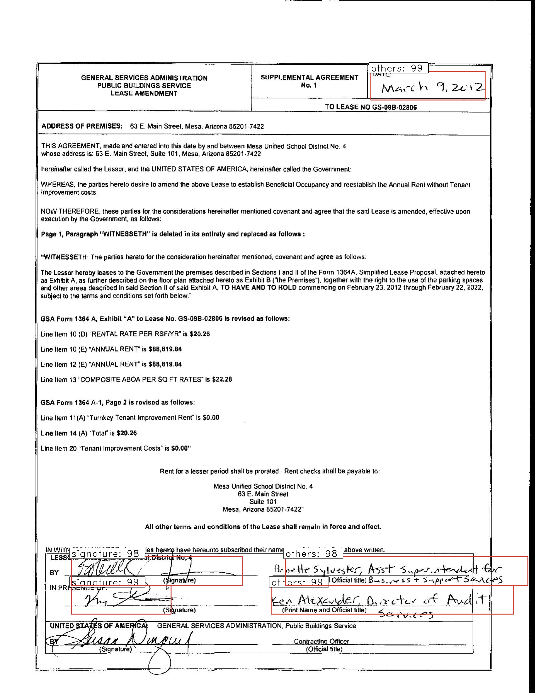

# Hand Written Text Detection on PDF documents using Faster R- CNN

The current solution involves the use of Faster R-CNN with regional proposal network to detection hand written text on scanned pdf documents,
the hand written text also involves finding of signature.

We are trying to detect to groups of text
- Signature
- Any other hand written text

The Faster R-CNN uses the pretrained Resnet50 model trained on COCO hand written dataset.
The code is written in Keras with Tensorflow backend and is compatible with Python3.
   
# Data
- We used a public repository of government contracts available here. https://www.gsa.gov/real-estate/real-estate-services/leasing-policy-procedures/lease-documents 
- We used the VOTT data labeling tool to speed our data labeling task, available at this link. https://github.com/Microsoft/VoTT

# Usage
- `train_frcnn.py` can be used to train a model. To train on Pascal VOC data, simply do:
`python train_frcnn.py -p /path/to/pascalvoc/`.

- simple_parser.py provides an alternative way to input data, using a text file. Simply provide a text file, with each
line containing:

    `filepath,x1,y1,x2,y2,class_name`

    For example:

    /data/imgs/img_001.jpg,837,346,981,456,cow
  
    The classes will be inferred from the file. To use the simple parser instead of the default pascal voc style parser,
    use the command line option `-o simple`. For example `python train_frcnn.py -o simple -p my_data.txt`.

- Running `train_frcnn.py` will write weights to disk to an hdf5 file, as well as all the setting of the training run to a `pickle` file. These
settings can then be loaded by `test_frcnn.py` for any testing.

- `test_frcnn.py`can be used to perform inference, given pretrained weights and a config file. Specify a path to the folder containing
images:
    `python test_frcnn.py -p /path/to/test_data/`

NOTES:
- config.py contains all settings for the train or test run. The default settings match those in the original Faster-RCNN
paper. The anchor box sizes are [128, 256, 512] and the ratios are [1:1, 1:2, 2:1].

# Example output

ISSUES:

- The model is trained for a very limited number of epochs and data, hence the model will not be able to capture all handwritten text.
- If you run out of memory, try reducing the number of ROIs that are processed simultaneously. Try passing a lower `-n` to `train_frcnn.py`. Alternatively, try reducing the image size from the default value of 600 (this setting is found in `config.py`.
